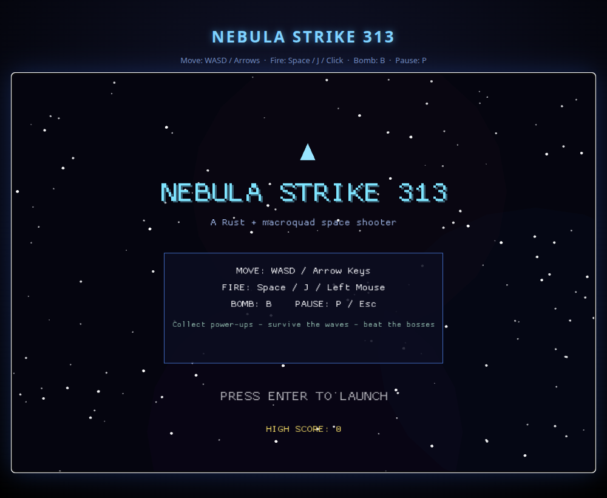
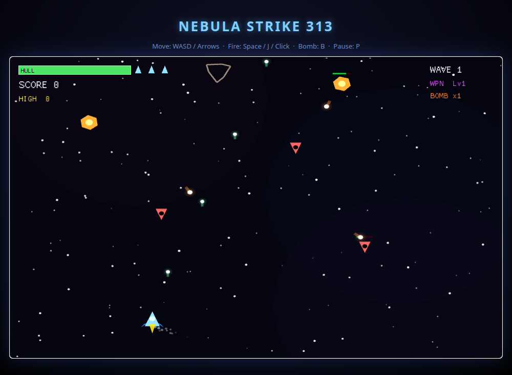

# Nebula Strike 313 / 星云突击 313

A fast-paced 2D space shooter written in **Rust** with the
[`macroquad`](https://github.com/not-fl3/macroquad) engine. It runs natively on
Windows / macOS / Linux **and** compiles to WebAssembly so it plays right in the
browser.

> 用 Rust + macroquad 开发的一款太空射击游戏，可原生运行，也可编译成
> WebAssembly 在浏览器里直接玩。




## Features / 特性

- **Smooth twin-stick-style flight** with momentum, friction and engine trails.
- **Five enemy archetypes**: Grunts, Shooters, Kamikaze, Asteroids and a
  multi-phase **Boss** every 5th wave (with a bullet-hell radial attack that
  escalates as its health drops).
- **Endless escalating waves** with a per-wave clear bonus.
- **Power-ups**: Rapid Fire, Spread Shot, Shield, Repair, extra Bomb and
  Weapon-Level up (up to 3 forward streams + diagonal spread).
- **Screen-clearing bombs**, combo multiplier, lives, and a persistent high score.
- **Juicy game feel**: particle explosions, hit sparks, screen shake, damage
  flashes, parallax starfield and drifting nebulae.
- Pure procedural vector art — **no binary asset files**, the whole game is code.

## Controls / 操作

| Action | Keys |
| ------ | ---- |
| Move   | `WASD` or Arrow keys |
| Fire   | `Space`, `J`, or Left Mouse |
| Bomb   | `B` |
| Pause  | `P` / `Esc` |
| Start / Continue | `Enter` |

## Requirements / 环境要求

- Rust **1.85+** (`macroquad 0.4.15` uses const float math). Install/upgrade with
  `rustup update stable`.
- Linux native builds need OpenGL + X11 (`libgl1`, `libx11-6`, `libxi6`,
  `libasound2`) available at runtime; these are loaded dynamically.

## Run natively / 原生运行

```bash
cargo run --release
```

## Play in the browser (WebAssembly) / 在浏览器中游玩

```bash
./build-web.sh                       # builds the wasm and stages it in web/
(cd web && python3 -m http.server 8080)
# open http://localhost:8080
```

The `web/` folder is self-contained (`index.html` + macroquad's
`mq_js_bundle.js` JS loader + the compiled `nebula_strike.wasm`), so it can also
be dropped onto any static host such as GitHub Pages.

## Project layout / 项目结构

```
src/
  main.rs        window config + game loop
  game.rs        state machine, waves, collisions, scoring, HUD/menus
  player.rs      ship: input, movement, weapons, power-up state
  enemy.rs       enemy types + behaviours + boss
  bullet.rs      projectiles
  powerup.rs     drops
  particle.rs    explosions / sparks / thruster embers
  starfield.rs   parallax background
  ui.rs          reusable HUD widgets
  utils.rs       math + drawing helpers
web/             browser harness (index.html, JS loader, wasm)
build-web.sh     one-shot WebAssembly build script
```

## A note on size / 关于体积

The game is intentionally lean: the stripped native binary is well under 1 MB and
the WebAssembly module is ~0.5 MB, which keeps load times instant. All visuals are
generated procedurally in code rather than shipping large image/audio assets, so
the "weight" of the game is in its gameplay rather than its download size.

## License

MIT
